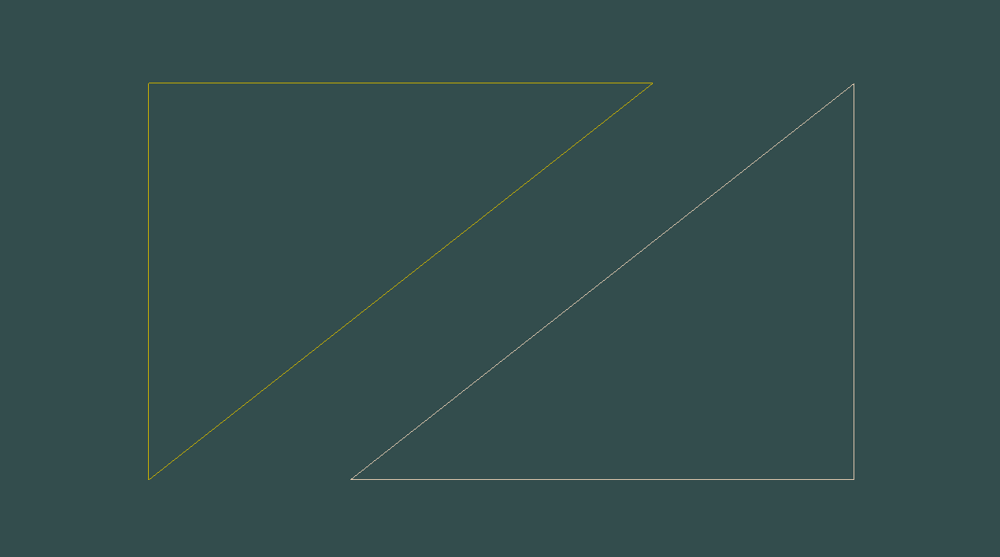
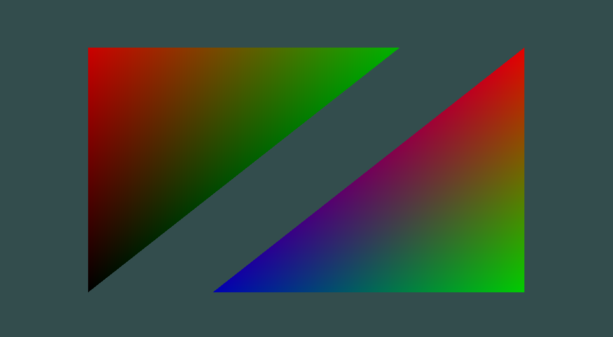
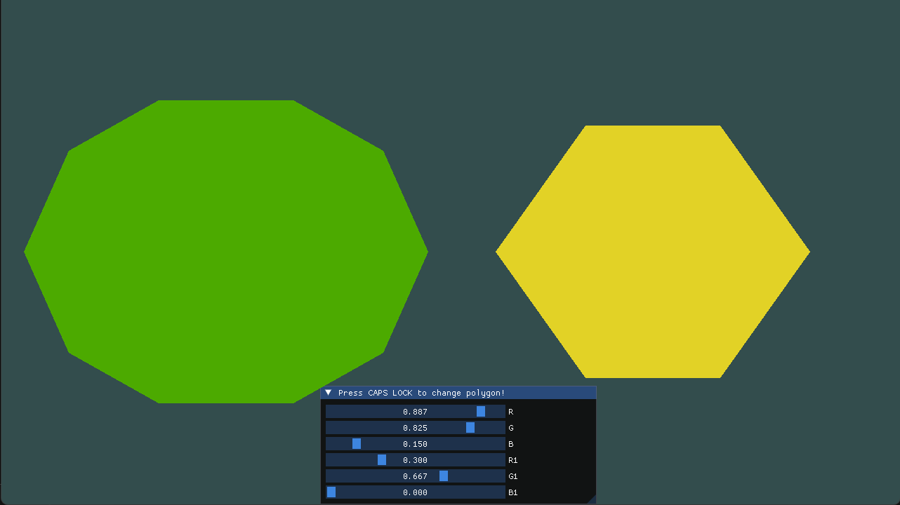
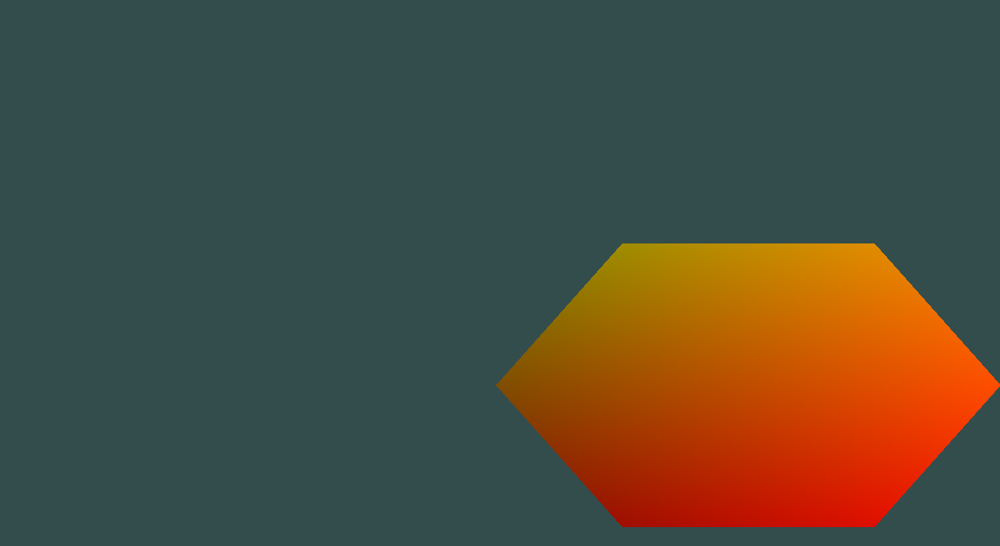
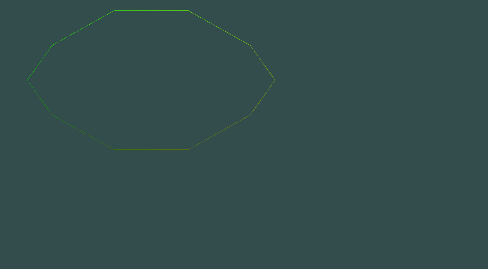
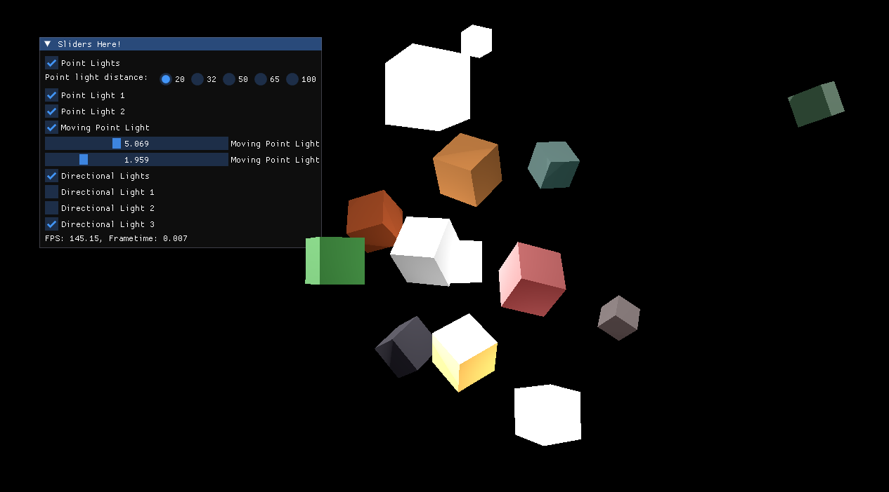
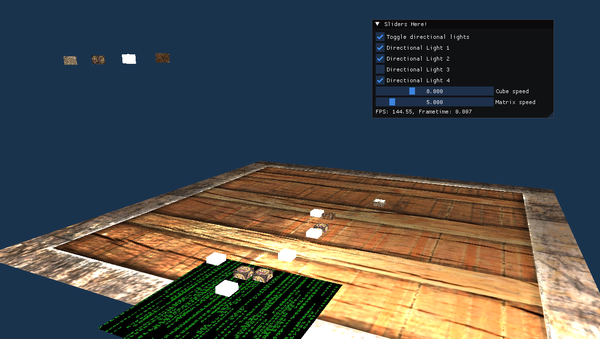

# OpenGL Capabilities Showcase

[](LICENSE)

This repository contains a collection of independent projects designed to demonstrate and familiarize developers with the OpenGL graphics library. The projects progress from low-level rendering fundamentals to complex scenes involving multiple moving objects and advanced lighting techniques.

## Table of Contents

- [Overview](#overview)
- [Prerequisites](#prerequisites)
- [Compilation](#compilation)
- [Showcase Descriptions](#showcase-descriptions)
- [License](#license)

## Overview

The goal of this repository is to provide clear, compilable examples of OpenGL features. The showcases evolve in complexity:
1.  **Basics**: Rendering basic primitives (triangles).
2.  **Intermediate**: Use of external libraries such as ImGUI, GLM and stb_image.
3.  **Advanced**: Complex scenes with multiple moving objects, dynamic lighting (point and directional), and material properties.

## Prerequisites

To compile and run these projects, you will need a UNIX-like environment with the following libraries installed:

*   **GLFW**: For window creation and input handling.
*   **GLEW**: For managing OpenGL extensions.
*   **OpenGL**: The core graphics library.

Ensure you have a C++ compiler (like `g++`) installed.

## Compilation

Using CMAKE you can compile all the projects at once and run them. They are 6 in total, consisting of a simple triangle hello world, 4 intermediate projects exploring rotations, lighting etc. and an advanced project consisting of multiple objects existing and modified by multiple light sources. From inside the project directory copy and paste the following code:

```
mkdir build
cd build
cmake ..
cmake --build . --config Release -j 4
```

Afterwards, all the files will be available in the newly created bin folder.

## Showcase Descriptions

### Showcase 1
*   **showcase1.cpp**: The entry point for OpenGL. This program sets up the window context and renders basic primitives (triangles) to the screen, demonstrating the fundamental graphics pipeline. There are 2 sets of triangles to choose upon, the ones with the colors baked along with their vertice positions and ones that can change dynamically using the uniform setup of opengl. You can also toggle a wireframe mode for the polygon.




### Showcase 2
This series introduces user interface elements and intermediate graphics concepts.
*   **showcase21.cpp**: Integration of Dear ImGui. Demonstrates how to overlay a debug/control UI on top of the OpenGL context. Can change the color of the vertices using imgui sliders. You can also display each polygon on its own and as a wireframe object.




*   **showcase22.cpp**: Introduction to transformations (Translation, Rotation, Scaling) controlled via the UI. You can move and toggle a polygon and dynamically changE its color based on the position that it is.



*   **showcase23.cpp**: Advanced rotations and translations. 3 cubes moving each based on each other, creating complex move patterns.


*   **showcase24.cpp**: Advanced lighting and materials. Introduces moving light sources and material properties interacting with light. You can toggle positional and directional lights, as well as control a moving light source.



### Showcase 3
*   **showcase3.cpp**: The culmination of the previous concepts. This program renders a complex scene with multiple moving objects. It features a comprehensive lighting system including static and moving lights, point lights, and directional lights, all configurable in real-time. Each time you press space you randomly spawn an object. The available objects are displayed on the side.



## License

This project is licensed under the MIT License - see the [LICENSE](LICENSE) file for details.